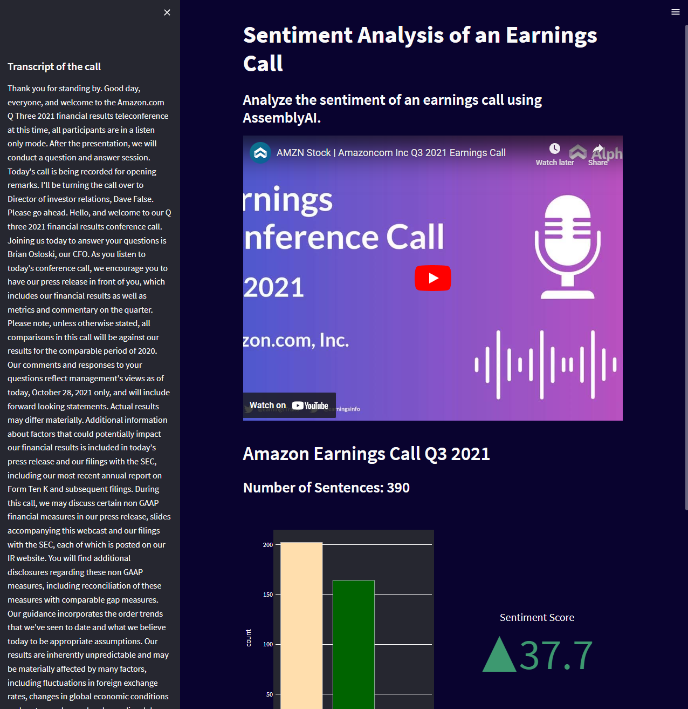

# Sentiment Analysis of an Earnings Call

## Description

This application shows how you can use AssemblyAI's powerful [Sentiment Analysis](https://www.assemblyai.com/blog/introducing-sentiment-analysis/) model to identify and visually display information on the sentiments expressed in a corporate earnings call.

Check out [this tutorial](https://youtu.be/kBoe56CfugY) to learn how to build an expanded version of this application that will allow you to perform similar Sentiment Analysis visualization on YouTube videos.

## To Run

* Download project files by running `git clone https://github.com/AssemblyAI/sentiment-analysis-on-earnings-call`
* Navigate to the project folder
* Ensure that [Streamlit](https://pypi.org/project/streamlit/) and [Plotly](https://pypi.org/project/plotly/) are installed
* Run the application using the `streamlit run app.py`

## How it Works

The application works by taking data from a JSON file that was created by [submitting a audio file](https://www.assemblyai.com/docs/audio-intelligence#sentiment-analysis) to the AssemblyAI API for transcription with `sentiment_analysis` set to `true`. That data is used to create visualizations like a the number of sentences identified with each sentiment, an indicator showing where each sentiment occurred in the audio file, and an overall Sentiment Score for the call.

you can view the results for a file you have submitted to the API with `sentiment_analysis` set to `true` by replacing the `response.json` file in the `json` folder with the JSON response from your request.

## Dependencies

* [Streamlit](https://pypi.org/project/streamlit/) The fastest way to build data apps in Python
* [Plotly](https://pypi.org/project/plotly/) An open-source, interactive data visualization library for Python